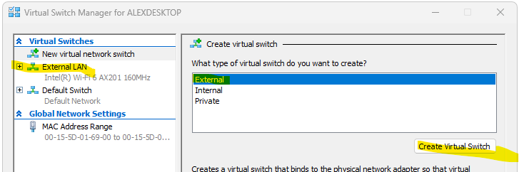
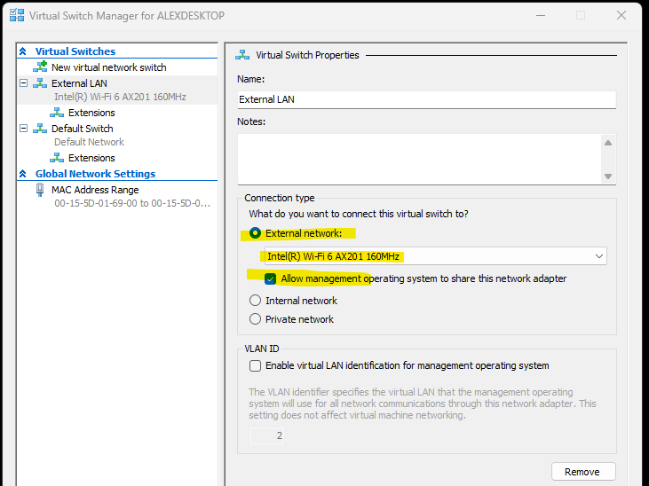

# ansible-homelab
ansible configuration for home servers

# windows network settings
type below command in command line or in Start > Run
`ncpa.cpl`
disable IP6 for Ethernet connections

# hyper-V config
Create External LAN network, it will be used for all VMs





# ssh key
ssh server will be configured to use only ed25519 keys. other keys will be disabled
`
ssh-keygen -t ed25519 -C "alex.gluhov@outlook.com"
`

# wsl
below is for Almalinux-10, but you can install other wsl distribution
* list all available wsl distributions. pick any for installation
  `wsl --list --online`
* install wsl distribution
  `wsl --install Almalinux-10`
* backup
  `wsl --export AlmaLinux-10 E:\backup\vm_backups\wsl\AlmaLinux10.tar`

# wsl initial config
install python 3.12
```
sudo dnf intall python3.12 python3.12-pip make
```
install uv (for current user) using pip
```
python3.12 -m pip install --user uv
```

# ansible
run playbook in dev only
```
uv run ansible-playbook -i inventory/hosts.yml playbooks/site.yml -vv -K --limit dev
```
dry run playbook in dev (no changes applied)
```
uv run ansible-playbook -i inventory/hosts.yml playbooks/site.yml -vv -K --limit dev --check --diff
```
